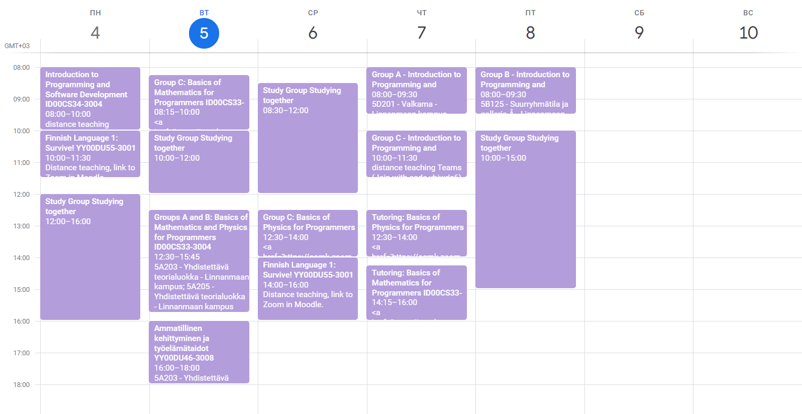
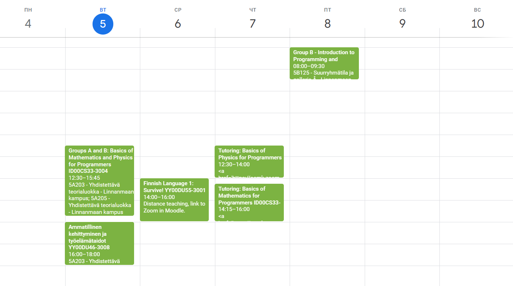

# ICS Cleaner
## Backstory
I've recently started at a new university. I decided to import my schedule to google calendar for convenience. The problem was that since I am in group B, I didn't want to see the classes of other groups, it's just distracting. That's why I needed an efficient way to delete all the unnecessary events from my calendar.
## What it does
The script deletes all the events from ics file that contain given keywords. For example for this test I used those keywords: *Group A, Group C, Study together*

| Before             | After               |
|--------------------|---------------------|
|  |  |

## How it works
The script opens the given .ics file, using icalendar library loops through subcomponents and stores those that don't contain any keywords in a list. After that it replaces the old list of subcomponents with a new one and saves the new calendar rewriting the original file.
## Possible Improvements
It would be much more convenient if the script made changes in the given google calendar directly
## Technology Stack
- **Icalendar** module